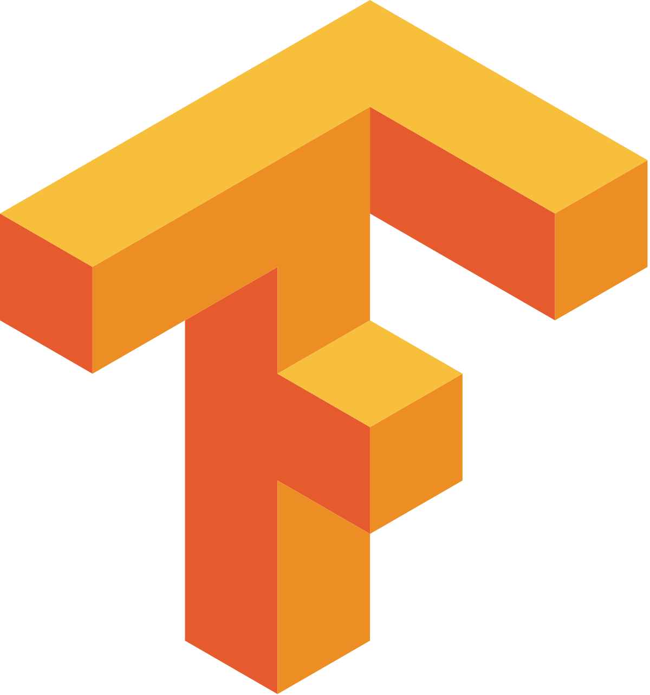

### Hi there, I'm Alexandre! :star: 
Master's student in Data Science at EPFL, currently doing my Master Thesis at Harvard University. Please find some of my research papers in the "Project-Papers" repo.

- 🔭 I’m currently working as a visiting researcher at Harvard University. My work focuses on segmentation models in Connectomics.
- :page_facing_up: Some of my research papers: "Project-Papers" repo
- 📫 How to reach me: alexandredipiazza@fas.harvard.edu 
- ⚡ Fun fact: Soccer Fan

## Skills

